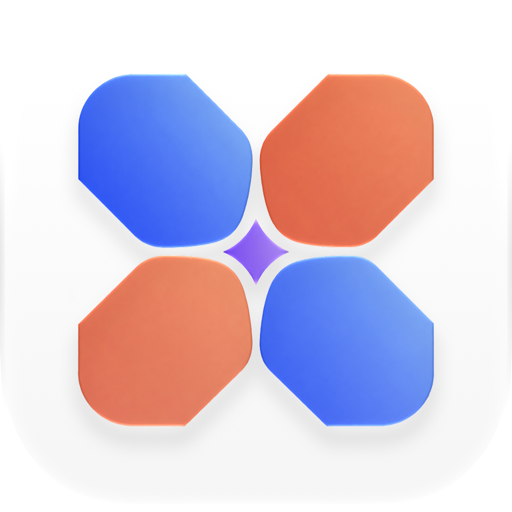
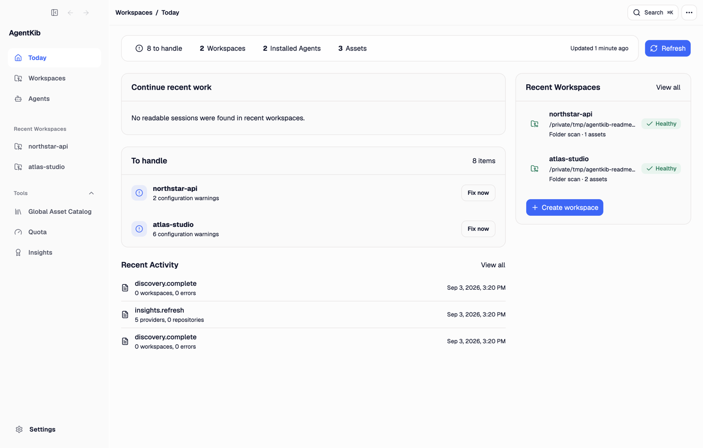
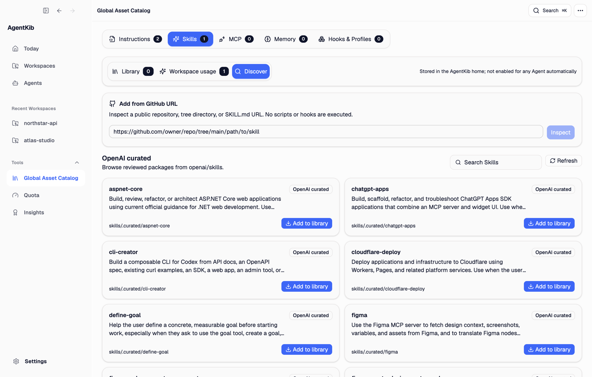
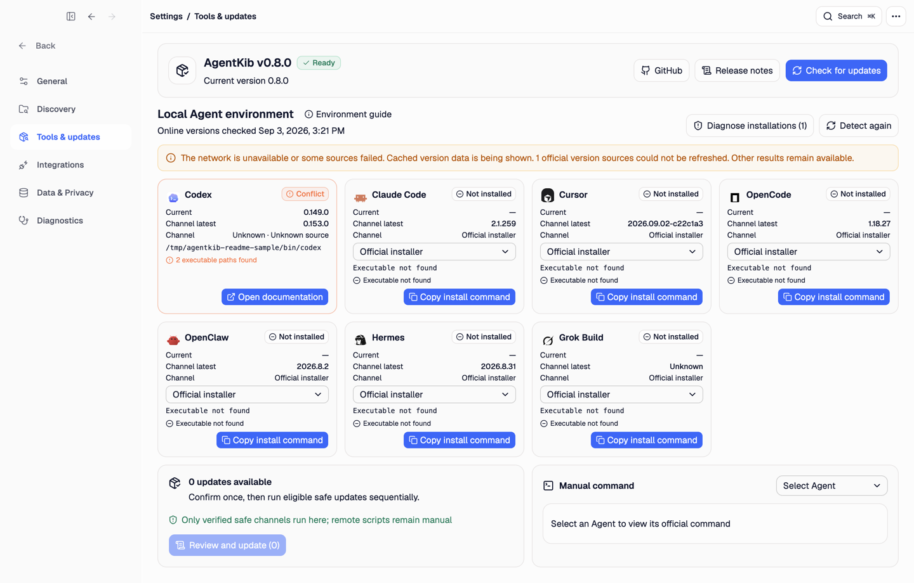

  

<h1 align="center">AgentKib</h1>

<strong>Inspect, organize, and safely maintain coding-agent context, Skills, sessions, and local toolchains.</strong>

  <a href="https://agentkib.com">Website</a> ·
  <a href="https://github.com/starroyhq/agentkib/releases/latest">Download</a> ·
  <a href="README.zh-CN.md">简体中文</a>

  
  
  
  

## Why AgentKib

Coding agents build up useful local state across project instructions, Skills, MCP connections, native configuration, and conversation history. That state is fragmented between different tools, making it hard to know what an agent can actually see, reuse trusted assets, or continue work safely elsewhere.

AgentKib brings that state into one local, inspectable desktop surface. Core discovery, diagnostics, Skill management, and session handoff do not require an AgentKib account, cloud database, or model API. **KIB** stands for **Knowledge & Instruction Base**.

## What AgentKib does

### Inspect effective context

See the Instructions, Skills, MCP connections, memory, and native configuration available to each agent in a workspace. Diagnose missing, drifted, invalid, or duplicated assets, then review a complete ChangeSet and diff before anything is written.

### Manage reusable Skills

Browse reviewed OpenAI Skills or inspect a public GitHub repository before adding a package to the local library. AgentKib pins managed packages to immutable commits, previews files and executable resources, detects updates and local drift, and supports rollback and recoverable removal. Library Skills are not enabled for an agent automatically.

### Continue across agents

Browse supported Codex and Claude Code session history and prepare a reviewed handoff. AgentKib preserves useful timeline context, redacts common sensitive values, and requires confirmation before writing or importing handoff artifacts.

### Keep local tools current

Inspect Codex, Claude Code, Cursor, OpenCode, OpenClaw, Hermes, and Grok Build installations. AgentKib reports each installation's version, source, executable path, PATH default, and conflicts. Verified package-manager or official-updater actions can run with pinned arguments; ambiguous, privileged, or remote-script flows fall back to official commands or documentation.

## Download

Download the current stable package from the [Latest Release](https://github.com/starroyhq/agentkib/releases/latest):

- macOS 13.3+: `.dmg` for Apple Silicon or Intel
- Windows 11: x64 `.exe`; ARM64 remains Preview
- Linux: Ubuntu `.deb` or AppImage, or Fedora `.rpm`; ARM64 remains Preview

Only use files from the official release and verify the matching `.sha256` checksum. Windows installers are not yet Authenticode-signed and may trigger SmartScreen. See [Upgrading](docs/UPGRADING.md) for in-app updates, package-specific upgrade paths, and historical macOS packages.

## Local-first safety

- Ordinary discovery and diagnostics do not invoke a model or upload project assets.
- Credentials, cookies, tokens, private keys, environment files, and message databases are not cataloged as assets or written to logs.
- Generated writes validate path boundaries and original hashes, create backups, and require review before applying.
- Agent Home changes use a separate high-risk confirmation flow; remote integrations retain their own permission boundaries.

## Support at a glance

- **Discovery and context:** Codex, Claude Code, Cursor, OpenCode, OpenClaw, Hermes, Grok Build, and read-only DeepSeek Harness diagnostics.
- **Session browsing and handoff:** Codex and Claude Code.
- **Tool management:** Codex, Claude Code, Cursor, OpenCode, OpenClaw, Hermes, and Grok Build. DeepSeek Harness is intentionally excluded.
- **Interface:** English, Simplified Chinese, Traditional Chinese, and Japanese; light, dark, and system themes.
- **Platforms:** macOS 13.3+, Windows 11, Ubuntu 22.04, and Fedora. ARM64 Windows and Linux packages remain Preview.

See the [complete feature and compatibility matrix](docs/FEATURES.md) for global views, workspace capabilities, agent support, and platform status.

## Documentation and community

- [Feature matrix](docs/FEATURES.md)
- [Development guide](docs/DEVELOPMENT.md)
- [Upgrade guide](docs/UPGRADING.md)
- [Release process](docs/RELEASE.md)
- [Contributing](CONTRIBUTING.md)
- [Security policy](SECURITY.md)
- [Third-party notices](THIRD_PARTY_NOTICES.md)
- [GitHub Issues](https://github.com/starroyhq/agentkib/issues)

Report security vulnerabilities privately according to the [security policy](SECURITY.md), not through a public issue. AgentKib is released under the [MIT License](LICENSE).
