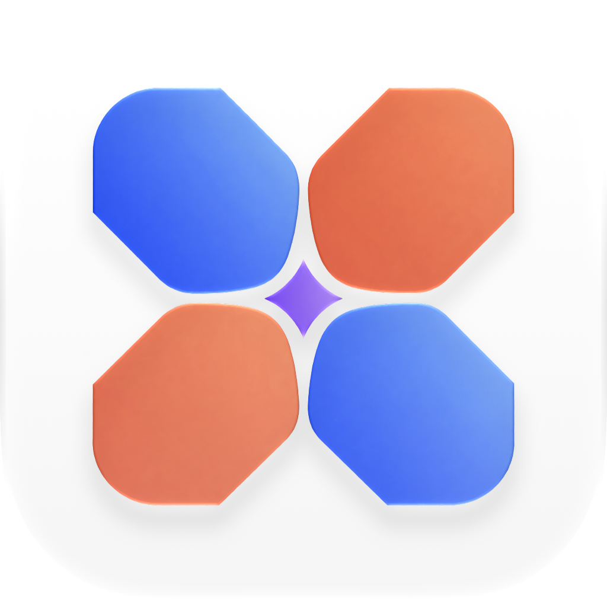
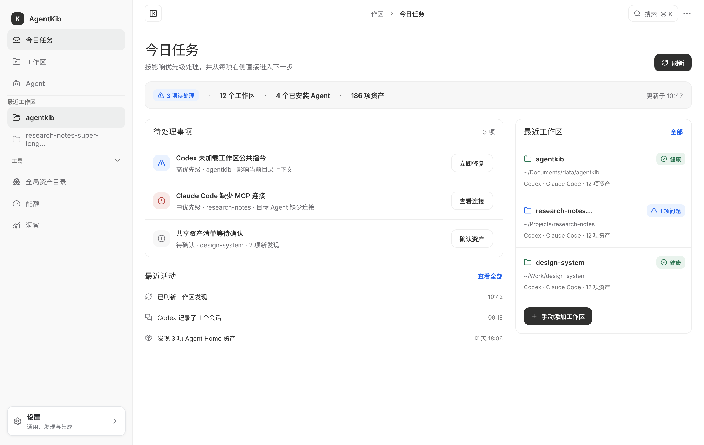
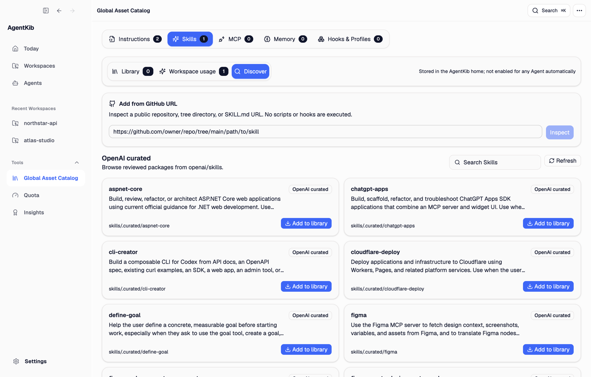
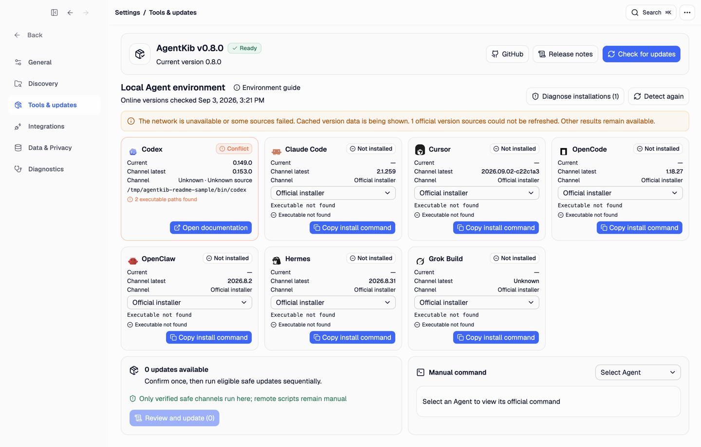

  

<h1 align="center">AgentKib</h1>

<strong>检查、组织并安全维护 Coding Agent 的上下文、Skills、会话与本地工具链。</strong>

  <a href="https://agentkib.com">官网</a> ·
  <a href="https://github.com/starroyhq/agentkib/releases/latest">下载</a> ·
  <a href="README.md">English</a>

  
  
  
  

## 为什么需要 AgentKib

Coding Agent 会在项目指令、Skills、MCP 连接、原生配置和会话历史中积累有价值的本地状态。这些状态分散在不同工具中，因此很难确认某个 Agent 实际能看到什么、复用可信资产，或者安全地换一个工具继续工作。

AgentKib 把这些状态汇集到一个本地、可检查的桌面界面中。基础发现、诊断、Skill 管理和会话交接不需要 AgentKib 账号、云端数据库或模型 API。**KIB** 代表 **Knowledge & Instruction Base（知识与指令底座）**。

### 管理 MCP 服务与 Agent 接入

收录原生或粘贴的 MCP 配置后默认停用，再显式启用和探测。集中预览可一次补齐多个已安装 Agent 的 Hub 连接，并按 Agent 分配具体工具，支持工作区覆盖与版本化写入。参见 [MCP 管理说明](docs/MCP-MANAGEMENT.md)。

## AgentKib 能做什么

### 检查实际生效的上下文

查看每个 Agent 在工作区内可用的 Instructions、Skills、MCP 连接、记忆和原生配置。诊断缺失、漂移、无效或重复的资产，并在任何写入发生前审查完整 ChangeSet 和 Diff。

### 管理可复用的 Skills

浏览经过审查的 OpenAI Skills，或在添加到本地资源库前检查公开 GitHub 仓库。AgentKib 将受管包固定到不可变 Commit，预览文件和可执行资源，检测更新与本地漂移，并支持回滚和可恢复移除。资源库中的 Skill 不会自动启用到任何 Agent。

已有安装可查看并复制入库，再经审查部署到个人或项目位置。部署独立更新、回滚和撤销，原安装不会被接管；共享目录影响与原生加载限制会分别说明。参见 [Skill 管理](docs/SKILLS.md)。

### 跨 Agent 继续工作

桌面与 Web 支持由主机所有者显式开启的本机正文搜索：查找消息或可读取的工具文字，定位并选择片段，加入当前草稿且保持目标会话不变，只有用户明确发送时才带入引用。其他已配对主机仍只搜索标题。参见[正文搜索与来源覆盖](docs/SESSION-CONTENT-SEARCH.md)。

浏览 Codex、Claude Code、Antigravity ACP、OpenCode、OpenClaw、Hermes 和 Grok Build 的本地会话。Codex、Claude Code、Antigravity ACP 与 OpenCode 会话可以生成经过审查的跨 Agent 交接；其余来源保持只读。AgentKib 会保留有用的时间线上下文、遮盖常见敏感值，并在写入或导入交接产物前请求确认。Antigravity 的原生导入与 Desktop/CLI 互操作限制见[Antigravity 接入边界](docs/ANTIGRAVITY.md)。

### 维护本地工具链

检查 Codex、Claude Code、Antigravity、Cursor、OpenCode、OpenClaw、Hermes 和 Grok Build 的安装。AgentKib 会显示每处安装的版本、来源、可执行路径、PATH 默认项和冲突。经过验证且能固定目标版本的包管理器操作可以直接执行；无法固定精确版本、来源不明、需要提权或远程脚本的流程只提供供用户审查的命令或官方文档。

## 内置 Web（开发预览）

monorepo 中的独立 Web 构建随 Electron 打包。在 **设置 → 远程连接** 中通过手机访问入口完成账号登录、设备登记与配对；本地/LAN Web 访问和自行配置 HTTPS 反向代理或隧道仍是独立可选路径，不要求官方协调服务。连接另一台桌面的原生 LAN 配对是另一条流程，见[原生远程连接](docs/REMOTE.md)。桌面应用必须保持运行。读取授权与控制权限相互独立。Claude Code 的桌面/Web 控制共用托管后端，支持新建、确认后的同 UUID 续接、图片/文件、审批和持久回执；基础控制保留 macOS 兼容门槛，高级控制要求 Claude Code `2.1.286` 或更新版本、主机开关及对应设备权限。Codex owner 控制仍受发布验收门槛限制。参见[自部署说明](docs/WEB-SELF-HOSTING.md)、[Claude 控制边界](docs/CLAUDE-WEB.md)、[本轮验收记录](qa/claude-remote-parity-2026-10-09.md)和[分层验收状态](qa/WEB-V1.md)。此处描述的是开发预览，不代表当前已发布版本已包含 Web。

Claude Remote 现有实现包括实际发现的模型/effort、会话工具权限、原生 `next` 插入、经过验证的原生历史分叉和标题，以及 AgentKib 管理的队列、归档和目标。仅修改模型会保留 CLI 继承的权限，未回报的权限模式保持未知。effort 设置支持原生模型别名；单独恢复 effort 默认值会重新继承 CLI 配置，并保留模型及权限选择。尚未首次发送的分叉在释放及确认重新接管后仍保留来源和截止点。主机/后端重启后，队列与目标需要手动恢复；目标预算使用原生轮次用量，完成必须同时具备结构化 MCP 报告和对应原生成功终态。用量缺口跨更新和重启保留，有限预算目标必须取得实际用量或明确移除预算后才能恢复。队列仅编辑待派发的纯文本条目并保留原设备；已派发条目和附件引用保持固定。浏览器继续使用 HTTP 操作与 SSE 更新；可选 `/api/web/v1/socket` WebSocket 适配器对有界请求复用相同鉴权和回执。托管网页到 LAN HTTP 的连接不开放这些高级控制和 socket。自动化通过不代表真实模型、实体手机或生产中继已验收。

## 下载

从 [Latest Release](https://github.com/starroyhq/agentkib/releases/latest) 下载当前稳定版本：

- macOS 13.3+：Apple Silicon 或 Intel 的 `.dmg`
- Windows 11：x64 `.exe`；ARM64 仍为 Preview
- Linux：Ubuntu `.deb` 或 AppImage、Fedora `.rpm`；ARM64 仍为 Preview

请只使用官方 Release 中的文件，并核对对应的 `.sha256` 校验值。Windows 安装包尚未进行 Authenticode 签名，可能触发 SmartScreen。应用内更新、不同安装包的升级方式和历史 macOS 包说明见[升级指南](docs/UPGRADING.md)。

## 本地优先的安全边界

- 普通发现和诊断不会调用模型，也不会上传项目资产。
- 凭据、Cookie、Token、私钥、环境文件和消息数据库不会被收录为资产或写入日志。
- 生成的写入会检查路径边界和原始哈希、创建备份，并在应用前要求审查。
- Agent Home 变更使用单独的高风险确认流程；远程集成保留各自的权限边界。

## 支持概览

- **发现与上下文：** Codex、Claude Code、Antigravity、Cursor、OpenCode、OpenClaw、Hermes、Grok Build，以及只读的 DeepSeek Harness 诊断。
- **会话浏览：** Codex、Claude Code、Antigravity ACP、OpenCode、OpenClaw、Hermes 和 Grok Build；后三者是只读来源。
- **经过审查的交接：** 支持以 Codex、Claude Code、Antigravity ACP 和 OpenCode 会话为来源，续接到受支持的本机 Agent。
- **工具管理：** Codex、Claude Code、Cursor、OpenCode、OpenClaw、Hermes 和 Grok Build。Antigravity 只提供安装检测与官方更新说明，不提供自动包管理操作；DeepSeek Harness 明确不在此范围内。
- **界面：** English、简体中文、繁體中文和日本語；支持浅色、深色与跟随系统主题。
- **平台：** macOS 13.3+、Windows 11、Ubuntu 22.04 和 Fedora；Windows 与 Linux ARM64 安装包仍为 Preview。

完整的全局视图、工作区能力、Agent 支持和平台状态见[功能与兼容矩阵](docs/FEATURES.md)。

开发版的新增只读来源和“找不到工作区”排查方式见[发现与历史阅读说明](docs/DISCOVERY-HISTORY.md)，实际验证范围见[分层 QA](qa/MULTI-AGENT-HISTORY.md)。

## 文档与社区

- [功能矩阵](docs/FEATURES.md)
- [开发文档](docs/DEVELOPMENT.md)
- [升级指南](docs/UPGRADING.md)
- [发布流程](docs/RELEASE.md)
- [贡献指南](CONTRIBUTING.md)
- [安全策略](SECURITY.md)
- [第三方许可](THIRD_PARTY_NOTICES.md)
- [GitHub Issues](https://github.com/starroyhq/agentkib/issues)

安全漏洞必须按照[安全策略](SECURITY.md)私密报告，不要创建公开 Issue。AgentKib 使用 [MIT License](LICENSE) 发布。
